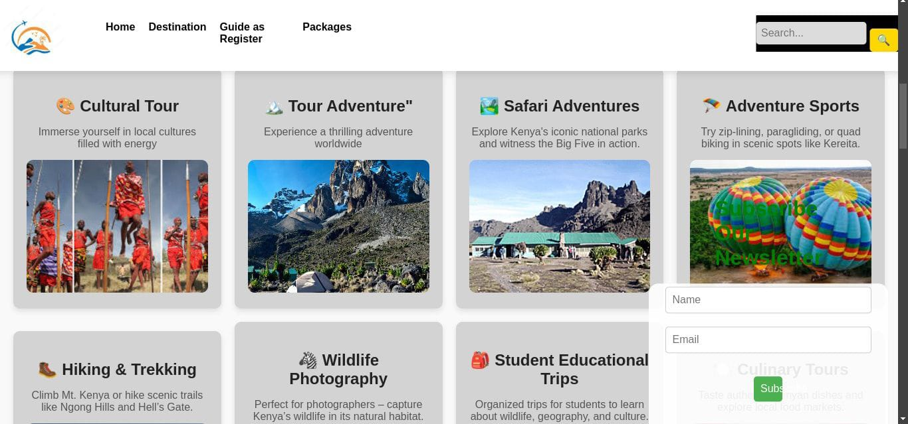

# 🏞️ Nadventure – Full-Stack Tour Company Web App with Cloud Deployment





**Nadventure** is a full-stack web application built for a tour and travel company, allowing users to explore destinations, book tours, and interact through a smooth, responsive interface. The backend is powered by **Django REST Framework**, the frontend is built with **React**, and the entire infrastructure is deployed on **Microsoft Azure** using **Terraform (Infrastructure as Code)**.

---

## 🚀 Features

### 🌍 User-Facing
- View and search tour packages
- Destination detail pages with images and itineraries
- Booking and inquiry forms
- Mobile-first responsive design

### 🛠️ Admin Panel
- Manage tour packages via Django Admin
- View and manage customer inquiries
- Update images, pricing, and schedules

### ☁️ DevOps & Deployment
- Infrastructure as Code using **Terraform**
- Deployed on **Microsoft Azure** (App Service, PostgreSQL/SQLite, Blob Storage)
- Environment variables managed securely
- CI/CD ready structure

---

## 🧰 Tech Stack

**Frontend:**
- React
- React Router
- Axios
- TailwindCSS / Bootstrap

**Backend:**
- Django (Python)
- Django REST Framework
- SQLite (development), PostgreSQL (production)

**DevOps & Infra:**
- Terraform
- Microsoft Azure (App Service, Storage Account, etc.)
- Azure CLI / ARM templates (optional)
- Git & GitHub

---

---

## 📦 Setup & Installation

### 🔧 Backend (Django)

1. 
  ```bash
# Clone the repo
git clone https://github.com/yourusername/nadventure.git
cd nadventure/backend

